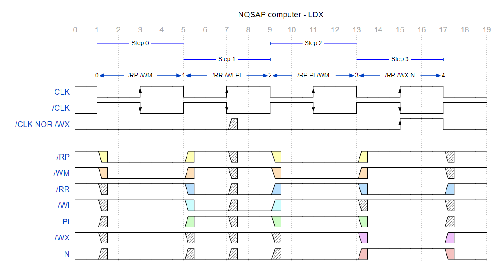

[{:width="100%"}](../../assets/sp/70-beam-sp.png)

## - WORK IN PROGRESS

L'implementazione dello stack nel 6502 consiste in un'area di memoria adibita alla memorizzazione e al ripristino di informazioni seguendo una logica LIFO (Last-In, First-Out), in cui l'ultimo elemento inserito è il primo a essere letto. Un puntatore (Stack Pointer) tiene traccia dell'indirizzo della prossima locazione libera. Due usi comuni sono il salvataggio dello stato attuale dei Flag prima di eseguire una routine che li modifica, così da poterli ripristinare alla fine della routine, e la memorizzazione dell'indirizzo di ritorno di una subroutine chiamata tramite l'istruzione JSR, anche in caso di chiamate annidate.

Lo Stack Pointer del 6502 è un registro, denominato S, la cui implementazione nel BEAM consta di due 4-bit Synchronous Binary Up-Down Counter <a href="https://www.ti.com/lit/ds/symlink/sn74ls157.pdf" target="_blank">74LS169</a>, in grado di indirizzare i 256 byte del computer. In definitiva, si tratta di un normale registro che, oltre a poter memorizzare un valore specifico, ha la peculiarità di poter anche contare sia verso l'alto, sia verso il basso.

// Quando utilizzato come indice dello stack deve essere inizializzato, magari a 240 ($F0).

Lo stack del 6502 occupa la seconda pagina di memoria indirizzabile dalla CPU, corrispondente agli indirizzi compresi tra 0x0100 e 0x01FF. Prima dell'utilizzo, lo Stack Pointer viene solitamente inizializzato a 0xFF, puntando così alla locazione 0x1FF. Quando si effettua un'operazione di scrittura nello stack ("Push"), il valore viene prima salvato nella posizione indicata dal puntatore, dopodiché lo SP viene decrementato per puntare alla successiva locazione libera. Al contrario, durante un'operazione di lettura dallo stack ("Pull"), il valore viene prima letto dalla posizione indicata dal puntatore, che viene poi incrementato per puntare alla prossima posizione disponibile.

In altre parole, poiché lo stack "cresce" verso il basso, lo Stack Pointer viene decrementato dopo ogni inserimento di un byte nello stack e incrementato prima di ogni prelievo di un byte.

I 74LS169 utilizzati nel BEAM non dispongono di un ingresso Reset, il che significa che, all'accensione, potrebbero trovarsi in uno stato indefinito. Per questo motivo, lo stack dovrà essere inizializzato dal programma caricato in memoria dall'utente.

### Controllare

Le istruzioni del 6502 che utilizzano lo stack:

- PHA, PLA
- JSR, RTS
- TXS, TSX -- NB TXS potrebbe fare al posto del CSP.

Lo Stack Pointer (SP) punta sempre alla successiva locazione disponibile nello stack, dunque:

- un'operazione di scrittura sullo stack decrementa prima lo SP (pre-decrement) e poi scrive il valore nella nuova locazione di memoria indicata dal puntatore (ad esempio, l'indirizzo di ritorno dell'istruzione JSR);
- un'operazione di lettura dallo stack restituisce prima il contenuto della locazione di memoria indicata dal puntatore e poi incrementa lo SP (post-increment).

## Implmentazione del microcode dello Stack Pointer

Analizziamo, ad esempio, un'istruzione JSR ipotizzando di aver inizializzato lo Stack Pointer (SP) del BEAM a 0xFF. Il BEAM dispone di soli 256 byte di memoria, quindi lo SP punta ora all'ultima locazione di memoria del computer.

~~~text
| ---- | ---------------------|
| Step | Microistruzione      |
| ---- | ---------------------|
| 0    | RPC | WM             |
| 1    | RR  | WIR | PCI      |
| 2    | RPC | WM             |
| 3    | RR  | WB   | PCI     |
| 4    | RS  | WM             |
| 5    | RPC | WR             |
| 6    | SE                   | *** devo mettere SUD??? anche nel microcode?
| 7    | RB  | WPC  | NI      |
| ---- | ---------------------|
~~~

*Scomposizione dell'istruzione JSR nelle sue otto microistruzioni elementari*.

1. Il primo step carica l'indirizzo del Program Counter nel Memory Address Register:
    - RPC, Read Program Counter - espone sul bus l'indirizzo del Program Counter
    - WM, Write Memory Address Register - scrive il contenuto del bus nel MAR
2. Il secondo step carica l'opcode dell'istruzione nell'IR e incrementa il PC per farlo puntare alla locazione di memoria successiva (che nel caso dell'istruzione NOP, lunga un solo byte, sarà la prossima istruzione):
    - RR, Read RAM - espone sul bus il contenuto della locazione di memoria puntata dal MAR
    - WIR, Write Instruction Register - scrive il contenuto del bus nell'Instruction Register
    - PCI, Program Counter Increment - incrementa il Program Counter
3. Il terzo step carica nel Memory Address Register l'indirizzo del Program Counter, che ora punta all'Operando:
    - RPC, Read Program Counter - espone sul bus l'indirizzo del Program Counter
    - WM, Write Memory Address Register - scrive il contenuto del bus nel MAR
4. Il quarto step legge l'operando, che punta alla destinazione del salto dell'istruzione JSR, lo salva in B e incrementa il PC che va ora a puntare la prossima prossima istruzione, che coincide con l'indirizzo di ritorno dalla subroutine
    - RR, Read RAM - espone sul bus il contenuto della locazione di memoria puntata dal MAR
    - WB, Write B - ????????????????????????????????????????????
    - PCI, Program Counter Increment - incrementa il Program Counter
6. Il sesto step carica l'indirizzo attuale al quale punta lo Stack Pointer nel Memory Address Registert
    - RS, Read Stack - ??????????????????????
    - WM, Write Memory Address Register - scrive il contenuto del bus nel MAR
6. Il sesto step carica nello stack l'indirizzo del PC, al quale il computer ritornerà alla fine della subroutine invocata dall'istruzione JSR
    - RPC, Read Program Counter - espone sul bus l'indirizzo del Program Counter
    - WR, Write RAM - ??????????????????????
7. Il settimo step abilita l'aggiornamento del PC al prossimo Rising Edge del clock
    - SE, Stack Enable - ??????????????????????
8. L'ottavo step carica nel PC l'indirizzo della subroutine invocata dall'iastruzione JSR
    - RB, Read B - ??????????????????????
    - WPC, Write Program Counter - ??????????????????????
    - NI, Next Instruction - resetta il Ring Counter

step legge l'operando, che punta alla destinazione del salto dell'istruzione JSR, lo salva in B e incrementa il PC che va ora a puntare la prossima prossima istruzione, che coincide con l'indirizzo di ritorno dalla subroutine

Al contrario RTS farà:

- leggere il valore dell'SP
- scrivere in PC il valore contenuto nella cella indicata dall'SP
- decrementare l'SP

## Lo Stack Pointer dell'NQSAP

Nella documentazione dell'NQSAP Tom segnala che si potrebbe usare anche un '193, ma con attenzione perché non ha il Count Enable e dunque bisogna usare una porta esterna per far arrivare un clock al contatore solo quando il segnale di Enable è attivato dalla ROM e dunque usa dei 169; attenzione ai glitch della ROM, dice… 05/01/2023 descritti in seguito

Poiché Tom non aveva puvvblicato lo schema dello Stack Pointer dell'NQSAP, lo sostituiamo con quello dell'NQSAP-PCB.

[{:width="100%"}](../../assets/sp/70-stack-nqsap-pcb.png)

*Schema dello Stack Register del computer NQSAP-PCB.*

- Successivamente, nell'NQSAP-PCB, ritorna sui suoi passi ed utilizza proprio un '193, che conta inviando un segnale a UP o DOWN del 193 abilitando SE Stack Enable insieme a C0 o C1 per definire la direzione del conteggio, dei quali viene fatto l'AND con il CLK.

- WS, sempre ANDed con CLK, permette di caricare un valore specifico nello stack.
- Si usano C0 e C1 per risparmiare segnali in uscita dalle EPROM… che clever questo tipo
  - C0 e C1 sono infatti condivisi con il Flag Register per la selezione del Carry in ingresso da ALU o H, dunque non bisogna modificare il CF nella stessa microistruzione di conteggio dell'SP.
  - In NQSAP-PCB dice che C0 e C1 sono anche condivisi con DY e DZ…
    - forse perché aveva pochi segnali disponibili ora che ha ridotto le ROM da 4 a 3… e infatti nella Control Logic a 3 ROM ci sono solo C0 e C1, che vanno sugli stessi pin del bus 26 e 27 di DY e DZ dei registri X e Y… 😁
dunque nemmeno istruzioni SP e X/Y possono avvenire nella stessa microistruzione (se consolido C0 e C1 con DY e DZ).

    - After the instruction fetch CO MI CE / RO II, the PC will have the value 21 and JSR microcode performs the following steps:
§ CO MI CE move the PC value to the MAR and increment the PC. MAR contains 21 and PC contains 22.
§ RO BI read the subroutine address from RAM[21] and place it in B for temp storage
§ SPO MI SPI move the SP value into the MAR and increment the SP.
§ CO RI store the PC value (which points to the next instruction) in memory, i.e. push the JSR return address on the stack.
BO PI move the B register value into the PC, effectively jumping to the subroutine

Add Val  Alla fine del JSR:
20 JSR  1) Devo avere $22 nella RAM $F0
21 $30  2) L'SP deve essere $F1
22 INX  3) PC deve passare a $30

Supponiamo di avere il seguente codice:

~~~text
| Indirizzo | Valore | Microistruzione                   |
| --------- | ------ | --------------------------------- |
| ...       | ?      | Istruzione precedente o operando  |
| 0x1F      | 0x0F   | Opcode istruzione NOP del BEAM    |
| 0x20      | 0x41   | Opcode istruzione JSR del BEAM    |
| 0x21      | 0x30   | Indirizzo di salto istruzione JSR |
| 0x22      | 0xA0   | Opcode istruzione NOP del BEAM    |
| ...       | ?      | Prossima istruzione               |
| --------- | ------ | --------------------------------- |
~~~

\* 0x41 è l'opcode utilizzato nel BEAM per definire l'istruzione JSR

***Mettere in giallo quello che cambia rispetto allo step precedente... possibile?***

Forse qui dovrei mettere anche lo step precedente allo zero e comunque controllare quel discorso di Tom , cioè che il PC in realtà per i primi due step dell'operazione ha ancora il valore precedente

~~~text
|------|-----|------|-----|------|------|------|------|------|------|
| Step |     |      |     | PC   | SP   | MAR  | RAM  | IR   | B    |
|------|-----|------|-----|------|------|------|------|------|------|
| 2*   | NI  |      |     |      |      |      |      |      |      |
| 0    | RPC | WM   |     | 0x20 | 0xFF | 0x20 | 0x41 | ?    | ?    |
| 1    | RR  | WIR  | PCI | 0x21 | 0xFF | 0x20 | 0x41 | 0x41 | ?    |
| 2    | RPC | WM   |     | 0x21 | 0xFF | 0x21 | 0x30 | 0x41 | ?    |
| 3    | RR  | WB   | PCI | 0x22 | 0xFF | 0x21 | 0x30 | 0x41 | 0x30 |
| 4    | RS  | WM   |     | 0x22 | 0xFF | 0xFF | ?    | 0x41 | 0x30 |
| 5    | RPC | WR   |     | 0x22 | 0xFF | 0xFF | 0x22 | 0x41 | 0x30 |
| 6    | SE  | SU/D |     | 0x22 | 0xFE | 0xFF | 0x22 | 0x41 | 0x30 |
| 7    | RB  | WPC  | NI  | 0x30 | 0xFE | 0xFF | 0x22 | 0x41 | 0x30 |
| 0**  | RB  | WPC  | NI  | 0x30 | 0xFE | 0xFF | 0x22 | 0x41 | 0x30 |
|------|-----|------|-----|------|------|------|------|------|------|
~~~

*Raffigurazione dello Stato dei registri al termine di ogni step.*

\* Ultimo step dell'istruzione NOP precedente
\** Primo step dell'istruzione INX successiva

Step NB queste sono le mie considerazioni
Fetch Adesso so che sto facendo una JSR
Exec 1 Metto nel MAR l'indirizzo della cella che contiene l'indirizzo a cui devo saltare
Exec 2 Leggo l'indirizzo a cui devo saltare dalla cella puntata dal MAR e lo scrivo temporaneamente in B
Exec 3 Leggo lo stack (che punta alla prima cella di memoria disponibile) e lo metto nel MAR; incremento il PC per ottenere il alore di "ritorno" dell'RTS
Exec 4 Scrivo il valore di ritorno dell'RTS nella cella di memoria indicata dallo stack
Exec 5 Incremento lo stack e scrivo B nel PC, così al prossimo clock eseguo il codice presente nell'indirizzo a cui dovevo altare

## Schema

[{:width="100%"}](../../assets/sp/70-stack-pointer-schema.png)

*Schema dello Stack Register del computer BEAM.*

## Link utili

- <a href="https://wilsonminesco.com/stacks/basics.html" target="_blank">Stack definition and basics</a> di Garth Wilson, contributore di <a href="http://www.6502.org" target="_blank">6502.org</a> e owner di <a href="https://wilsonminesco.com/" target="_blank">Wilson Mines Co.</a>, primaria fonte di articoli sul 6502, nozioni, tutorial ed altro. Garth offre una serie di compendi incredibilmente utili su tutto ciò che riguarda il 6502 ed affini.
- ??????????????????????
- ??????????????????????

## TO DO

- /WE ↘↗
- controllare se il mio SP funziona correttamente; vedo che Tom ha usato dei cablaggi diversi per i pin 7 e 10   20-08-2024
