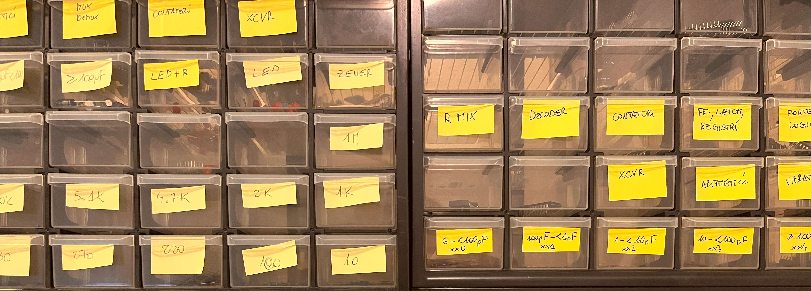
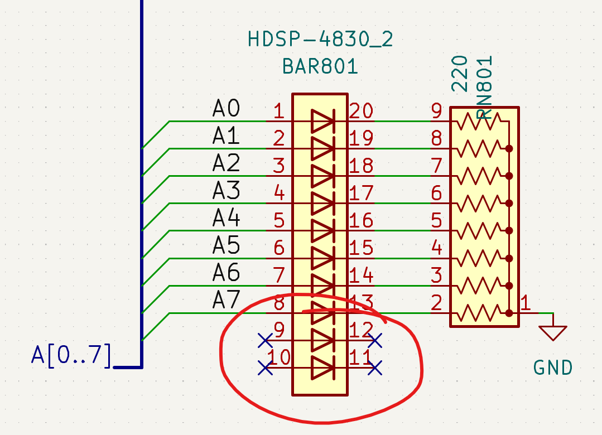
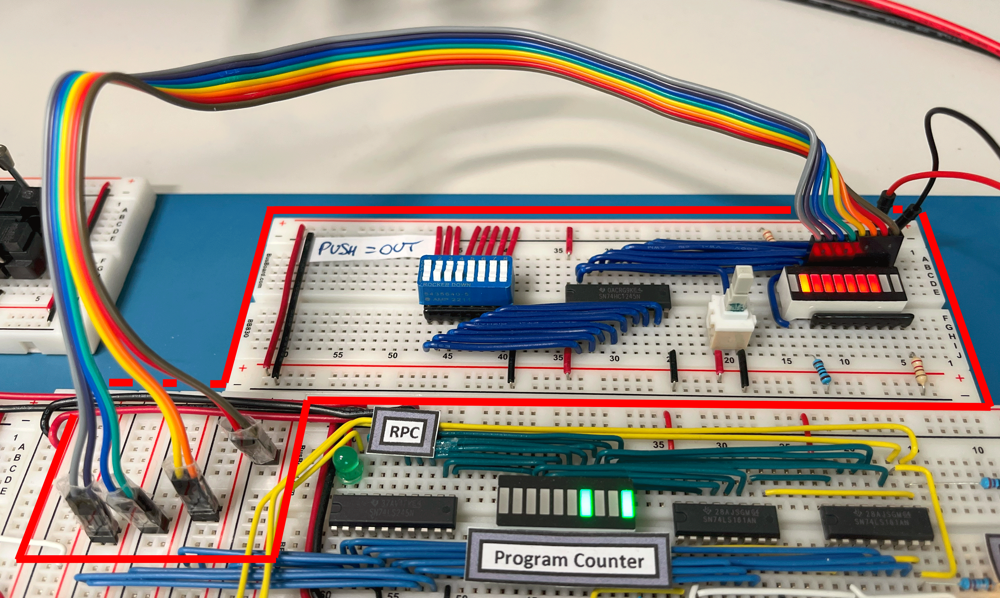
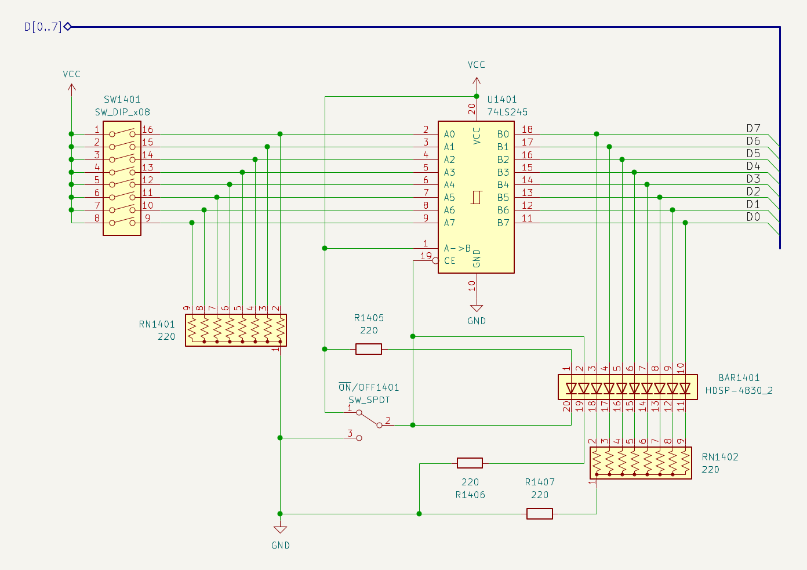

<small>[Componenti](#componenti) - [LED](#led) - [Varie](#varie) - [Breadboard e cavi](#breadboard-e-cavi) - [Alimentazione](#alimentazione) - [Circuito di test](#circuito-di-test)</small>

[{:width="100%"}](../../assets/varie/cassetti.png)

Alcune note generali sulla costruzione del computer BEAM.

## Componenti

Quasi tutti i componenti utilizzati in questo progetto sono stati acquistati su <a href="https://www.mouser.com/" target="_blank">Mouser.com</a>. I costi sono in linea con quelli degli altri portali, ma le spese di trasporto e sdoganamento sono assorbite da Mouser per ordini superiori a €100. La spedizione dagli Stati Uniti è molto veloce; ho ricevuto tutti gli ordini in due giorni lavorativi.

### LED

Per comodità, i LED singoli di colore rosso, giallo e verde utilizzati nel computer BEAM includono una resistenza interna che permette la connessione diretta a 5V e, dunque, anche direttamente alle uscite logiche TTL. Sono <a href="https://www.mouser.it/c/optoelectronics/led-lighting/leds-light-emitting-diodes/single-color-leds/?m=Kingbright&mounting%20style=Through%20Hole&package%20%2F%20case=T-1%203%2F4%20%285%20mm%29&vf%20-%20forward%20voltage=5%20V" target="_blank">disponibili presso Mouser</a> a circa 20/25 centesimi l'uno per quantità 10 o superiori.

Per motivi di spazio, i LED singoli non sono stati inclusi negli schemi Kicad.

Infine, poiché i simboli Kicad includono solo LED BAR a 10 LED, nelle situazioni dove non sono necessari tutti i 10 LED, alcuni di questi appaiono disconnessi.

{:width="50%"}

*LED BAR con 2 LED non connessi.*

### Varie

Invece dei più comuni dip-switch, nei moduli MAR e RAM ho utilizzato dei comodissimi Rocker Switch ("a bilanciere") come quelli in figura; si trovano facilmente presso i distributori di <a href="https://us.rs-online.com/product/te-connectivity/5435640-5/70156004/" target="_blank">materiale elettronico</a>. Notare che i pin originali sono piuttosto corti e non fissano correttamente lo switch alla breadboard, pertanto ho aggiunto uno zoccolo per circuiti integrati.

[{:width="33%"}](../../assets/ram/20-ram-rocker.png)

*Rocker Switch.*

### Breadboard e cavi

Le breadboard utilizzate sono le <a href="https://eu.mouser.com/ProductDetail/BusBoard-Prototype-Systems/BB830?qs=VEfmQw3KOauhPeTwYxNCaA%3D%3D" target="_blank">BB830</a> incluse anche nei kit di Ben Eater. La qualità dei contatti è decisamente superiore a quella delle breadboard economiche che si trovano online per pochi Euro e il costo aggiuntivo ripaga ampiamente il non doversi preoccupare dei falsi contatti e delle conseguenti problematiche così difficili da individuare.

Anche per i cavi mi sono affidati agli ottimi <a href="https://www.jameco.com/z/JMS9313-01G-22-AWG-6-Color-Solid-Tinned-Copper-Hook-Up-Wire-Assortment-25-Feet_2153705.html" target="_blank">AWG22</a> che ho scoperto con i kit di Ben Eater del <a href="https://eater.net/8bit" target="_blank">computer SAP a 8 bit</a> e del <a href="https://eater.net/6502" target="_blank">computer 6502</a>.
Il vantaggio di questi cavi rispetto agli altri AWG22 che ho trovato (e provato) è la dimensione dell'isolamento, più sottile, che permette una maggiore densità nel cablaggio. Purtroppo, non li ho trovati né in Europa né su Mouser, pertanto, li ho ordinati forzatamente presso Jameco, sobbarcandomi anche il costo aggiuntivo del trasporto e della dogana. Notare invece che i cavi AWG22 venduti da Amazon, pur citati nelle Parts list di Ben Eater, presentano un isolamento più spesso che, secondo le mie preferenze, è meno adatto.

## Alimentazione

Leggendo le esperienze degli altri utenti su <a href="https://www.reddit.com/r/beneater/" target="_blank">reddit</a>, sembra che quello dell'alimentazione sia un problema abbastanza diffuso. Le FAQ ed altri documenti <a href="https://www.reddit.com/r/beneater/wiki/tips/" target="_blank">scritti da altri utenti</a> offrono ottimi suggerimenti e aiutano indirizzare le questioni di distribuzione dell'elettricità. Per quanto mi riguarda, dopo essere partito con una semplice distribuzione laterale come avevo fatto nel SAP-1, ho aggiunto una linea di alimentazione al centro del computer inserendo una ulteriore fila di sezioni laterali ritagliate dalle breadboard.

[{:width="40%"}](../../assets/varie/power-bus.png)

Come si potrà notare nelle foto, non ho utilizzato condensatori nel BEAM, così come non li avevo utilizzati nemmeno nel SAP-1: confidavo nella frequenza estremamente bassa di utilizzo del computer e devo dire che entrambi i sistemi sono stabili.

Infine, nelle mie realizzazioni ho notato che i chip TTL sembrano tollerare tensioni inferiori rispetto a quelle indicate nei datasheet. In alcuni casi, prima di migliorare la distribuzione dell'elettricità con la linea centrale descritta poc'anzi, alcuni chip funzionavano bene anche a 4,3 Volt.

## Circuito di test

Anziché utilizzare jumper e LED temporanei per settare e visualizzare input ed output sul bus e sui moduli in costruzione, ho costruito un semplice circuito di prova, che si è dimostrato particolarmente comodo per accelerare test ed eventuali fasi di troubleshooting.

[{:width="100%"}](../../assets/varie/test-board.png)

*Modulo di test in lettura dal bus.*

Con il pulsante premuto, viene emesso un output corrispondente ai bit impostati sullo switch a bilanciere, mentre il pulsante rilasciato permette di visualizzare sulla LED bar i segnali presenti in input. I primi due LED di sinistra rappresentano rispettivamente l'impostazione del circuito in output o in input.

[{:width="100%"}](../../assets/varie/test-schema.png)

*Schema del modulo di test.*
