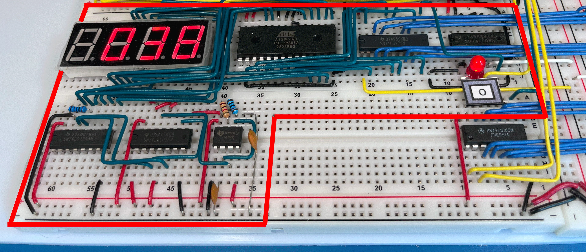
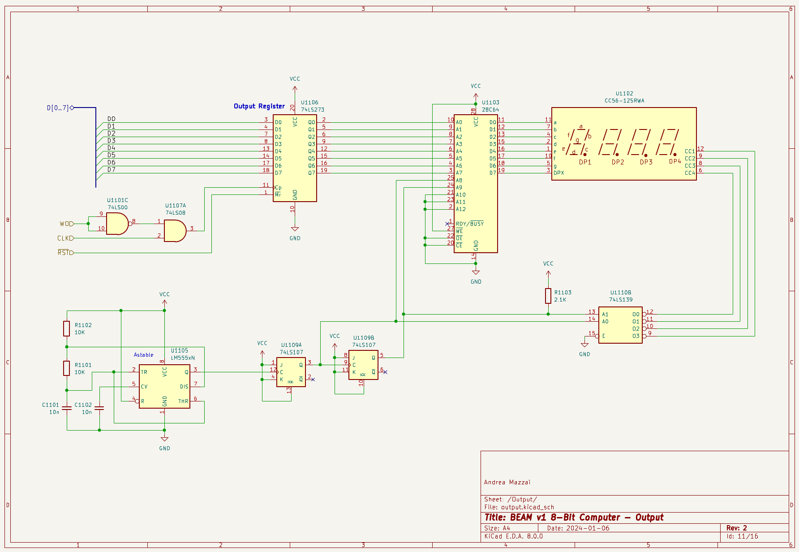

[{:width="100%"}](../../assets/output/65-beam-output.png)

Il modulo di output del BEAM è sostanzialmente identico a quello del SAP-1 di Ben Eater. Le due differenze sono:

- utilizzo di un display a 4 cifre anziché di 4 display a singola cifra;
- modalità di output solo decimale, senza la possibilità di scegliere quella esadecimale.

## Schema

[{:width="100%"}](../../assets/output/65-output-schema.png)

*Schema del modulo Output del computer BEAM.*

## Link utili

- I video di Ben Eater che descrivono la realizzazione del <a href="https://eater.net/8bit/output" target="_blank">modulo di Output</a>.
