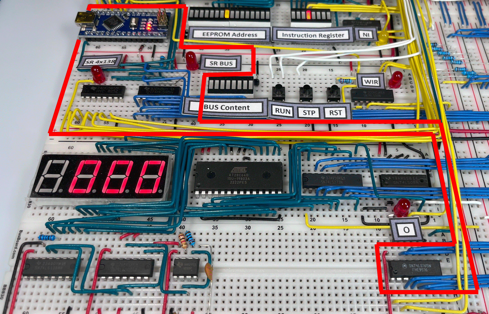
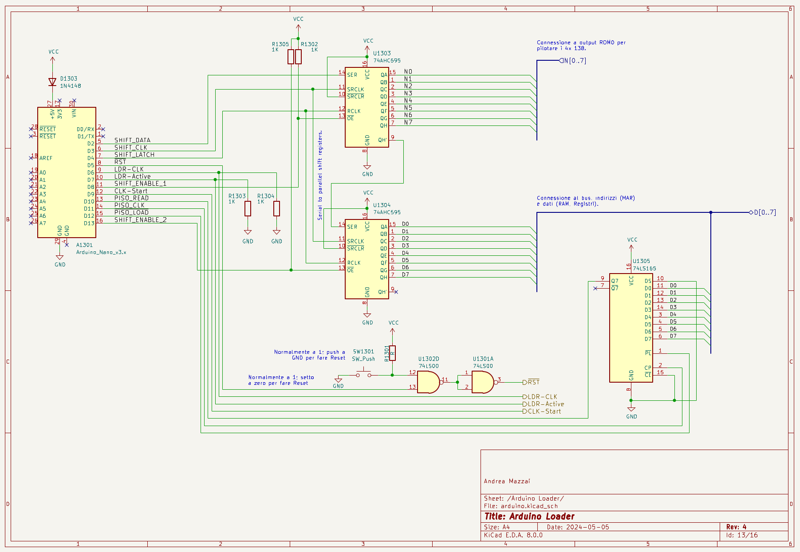

<small>[Caricamento di un programma](#caricamento-di-un-programma) - [Schema](#schema) - [Link utili](#link-utili)</small>

[{:width="100%"}](../../assets/loader/80-beam-loader.png)

Dopo aver completato il [computer SAP-1 a 8-bit](../../#computer-a-8-bit-in-logica-ttl-sap), cercavo un modo per automatizzare il caricamento dei programmi in memoria, poiché farlo manualmente a ogni riaccensione utilizzando i dip-switch risultava piuttosto noioso. Avevo anche intenzione di incorniciarlo e appenderlo come un quadro per mostrarlo ai visitatori. Prendendo confidenza con Arduino, avevo realizzato che avrei potuto collegare le sue uscite a MAR, RAM e al pulsante di Write per gestire automaticamente la programmazione del computer, simulando esattamente le sequenze manuali.

Ero partito da un progetto di <a href="https://github.com/dmytrostriletskyi/8-bit-computer-memory-init" target="_blank">Dmytro Striletskyi</a> modificandolo in modo da caricare ed eseguire automaticamente due programmi, 'Fibonacci' e 'Counter', ciascuno con una durata di esecuzione specifica. Alla fine di ogni ciclo di esecuzione, Arduino ferma il clock, carica in memoria il programma successivo, riattiva il clock e resetta il computer.

Il numero di segnali necessari (8 bit per la RAM, 4 per gli indirizzi, Reset, Start/Stop Clock, Write Memory e Program Mode, per un totale di 16) permetteva l'uso di un Arduino Nano senza bisogno di componenti aggiuntivi.

Nel BEAM, il caricamento dei programmi può essere eseguito sia manualmente che automaticamente grazie al modulo Loader, migliorato rispetto a quello del SAP.

Avevo studiato con attenzione le due realizzazioni di Tom, diverse tra NQSAP ed NQSAP-PCB, decidendo di sfruttare quanto appreso da quella basata su Shift Register dell'NQSAP-PCB.

La mia realizzazione comprende due 8-Bit Shift Register <a href="https://www.ti.com/lit/ds/symlink/sn74hc595.pdf" target="_blank">74HC595</a> e un Parallel Load 8-Bit Shift Register <a href="https://www.ti.com/lit/ds/symlink/sn54ls165a-sp.pdf" target="_blank">74LS165</a>. I primi vengono utilizzati per scrivere sul BEAM, mentre il secondo è utilizzato per leggere dal bus.

## Caricamento di un programma

Il Loader attiva tre segnali di controllo e uno di clock:

- **CLK-Start**, che disattiva temporaneamente l'astabile del modulo di clock e lo riattiva alla fine della programmazione, avviando automaticamente l'esecuzione del programma appena caricato.
- **LDR-Active**, che inibisce l'output dei segnali di clock generati dal BEAM (astabile e monostabile manuale), le due EEPROM che governano i '138 ed alcuni altri segnali di controllo. Questi ultimi - al momento - non sono gestiti dal Loader; una futura evoluzione dovrebbe permettere di effettuare dei test sui registri Flag e H.
- **Reset**, che inibisce l'incremento del RC durante la programmazione.
- **LDR-CLK**, che si sostituisce al clock del computer per la programmazione della RAM da parte del Loader.

L'operazione di scrittura di un byte è effettuata in due fasi, ripetute per tutta la lunghezza del programma da caricare:

1. caricamento del MAR con l'indirizzo di memoria da scrivere (funzione setAddress(byte address))
2. scrittura sulla RAM del byte di programma (funzione writeRAM(byte data))

~~~c++
void setAddress(byte address)
{
  // attiva i '595
  digitalWrite(SHIFT_ENABLE_1, LOW);
  digitalWrite(SHIFT_ENABLE_2, LOW);
  // carica sui '595 indirizzo e segnale WM
  shiftOut(SHIFT_DATA, SHIFT_CLK, MSBFIRST, address); // indirizzo
  shiftOut(SHIFT_DATA, SHIFT_CLK, MSBFIRST, 0x70); // configura i 138 per scrittura MAR (WM)
  // aggiorna l'output dei '595 con quanto caricato sopra
  digitalWrite(SHIFT_LATCH, LOW);
  digitalWrite(SHIFT_LATCH, HIGH);
  digitalWrite(SHIFT_LATCH, LOW);
  // impulso di clock
  digitalWrite(LDR_CLK, LOW);
  digitalWrite(LDR_CLK, HIGH);
  delay(DELAY); // 1 ms
  digitalWrite(LDR_CLK, LOW);
  digitalWrite(SHIFT_ENABLE_1, HIGH);
  digitalWrite(SHIFT_ENABLE_2, HIGH);
}

void writeRAM(byte data)
{
  // attiva i '595
  digitalWrite(SHIFT_ENABLE_1, LOW);
  digitalWrite(SHIFT_ENABLE_2, LOW);
  // carica sui '595 byte e segnale WR
  shiftOut(SHIFT_DATA, SHIFT_CLK, MSBFIRST, data); // byte da 
  shiftOut(SHIFT_DATA, SHIFT_CLK, MSBFIRST, 0x60); // configura i 138 per scrittura RAM (WR)
  // aggiorna l'output dei '595 con quanto caricato sopra
  digitalWrite(SHIFT_LATCH, LOW);
  digitalWrite(SHIFT_LATCH, HIGH);
  digitalWrite(SHIFT_LATCH, LOW);
  // impulso di clock
  digitalWrite(LDR_CLK, LOW);
  digitalWrite(LDR_CLK, HIGH);
  delay(DELAY); // 1 ms
  digitalWrite(LDR_CLK, LOW);
}
~~~

Alla fine del processo di scrittura, il '165 viene utilizzato per leggere il contenuto dell'ultima locazione di memoria del computer e memorizzarlo temporaneamente sul Loader, permettendo l'esecuzione di un gioco di luci sui LED che visualizzano il contenuto della RAM. Il gioco consiste nello scorrimento dei LED per simulare l'effetto dell'iconico scanner dell'auto <a href="https://www.youtube.com/watch?v=bMVbaCiy_XE" target="_blank">KITT</a> dalla serie televisiva Supercar. Per eseguire questo effetto, si esegue il caricamento del pattern di scorrimento nella locazione citata e, per questo, è necessario ripristinarla alla fine della routine.

<video src="../../assets/loader/KITT.mp4" controls title="Title" width="45%"></video>

Dopo il gioco di luci, il contenuto dell'ultima locazione di memoria viene ripristinato e il controllo passa al programma caricato: i '595 vengono disabilitati, le ROM riattivate, il Reset disattivato e il clock riabilitato.

Il Loader include anche un tasto Reset manuale.

## Schema

*Schema del Loader del computer BEAM.*

## Differenze tra Loader dell’NQSAP/NQSAP-PCB e del BEAM

Nelle implementazioni del Loader per i suoi progetti, Tom utilizza Flip-Flop o Shift Registers per pilotare i segnali di controllo e i pin di Arduino per scrivere e leggere sul bus. Il Loader del BEAM utilizza invece Shift Registers sia per scrivere e leggere sul bus, sia per la gestione della maggior dei segnali. Su Arduino restano disponibili diversi pin, che potrebbero in futuro essere utilizzati per controllare altri segnali ed effettuare dei test di funzionamento dei vari registri del computer.

## Link utili

- Il <a href="https://tomnisbet.github.io/nqsap/docs/loader/" target="_blank">Loader dell'NQSAP</a> di Tom Nisbet.
- Il <a href="https://tomnisbet.github.io/nqsap-pcb/docs/loader/" target="_blank">Loader dell'NQSAP-PCB</a> di Tom Nisbet.
